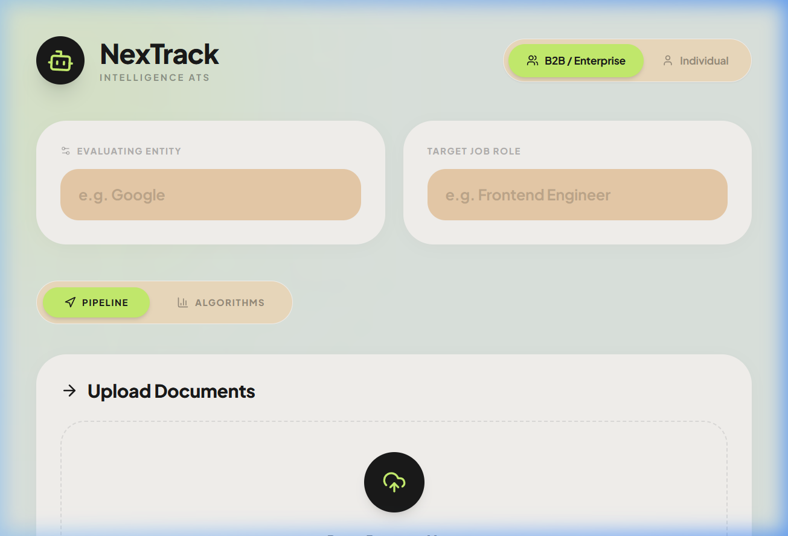
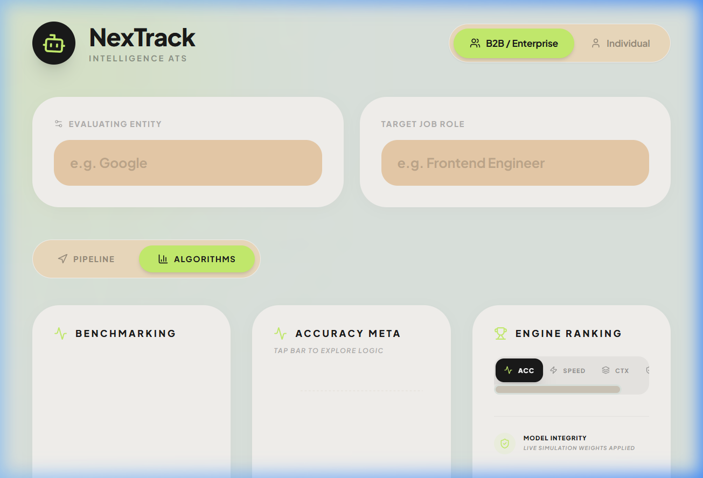

# NexTrack: Intelligence ATS Dashboard 🚀

NexTrack is a high-fidelity, research-oriented Applicant Tracking System (ATS) designed to provide absolute transparency into the "Black Box" of AI recruitment. Built for conference presentations and enterprise evaluation, NexTrack uses a **GNN-SLM Hybrid engine** to map candidate skills with mathematical precision.



## 🧠 Core Technology: GNN-SLM Hybrid
Unlike traditional ATS which rely on simple keyword counting, NexTrack implements a multi-tiered analysis pipeline:

1.  **Keyword Matching (Baseline)**: High-speed, low-context exact string intersection.
2.  **Cosine Similarity (Vectorized)**: TF-IDF weighted vector analysis of candidate experience vs. job requirements.
3.  **S-BERT (Semantic)**: Deep learning transformer models that understand "Backend Engineer" and "Node.js Developer" are semantically linked.
4.  **GNN-SLM (Neural Graph)**: Our proprietary Graph Neural Network logic that maps skill propagation and detects "Context Mismatch" (e.g., distinguishing a Salesman who mentioned Python once from a dedicated Data Analyst).

## ✨ Key Features
- **Universal Skill Ranking**: Context-aware ranking engine that prioritizes skills based on the selected Job Role (Cloud, Sales, Data, etc.).
- **Interactive Algorithm Leaderboard**: Real-time sorting of engines based on Accuracy, Speed, Context, and Reliability.
- **Neural Connectivity Visualization**: Live SVG-based Graph visualization of how the GNN propagates confidence across the candidate's skill set.
- **Precision Tie-Breaking**: Deep matching power that distinguishes between high-scoring candidates based on raw skill density and semantic alignment.
- **Glassmorphism UI**: A premium, "HopeRise" aesthetic designed for maximum readability and visual impact.



## 🛠️ Tech Stack
- **Framework**: [React 18](https://reactjs.org/) with [TypeScript](https://www.typescriptlang.org/)
- **Build Tool**: [Vite](https://vitejs.dev/)
- **Styling**: [Tailwind CSS](https://tailwindcss.com/) (Vanilla CSS Architecture)
- **Animations**: [Framer Motion](https://www.framer.com/motion/)
- **Icons**: [Lucide React](https://lucide.dev/)
- **Visualization**: [Recharts](https://recharts.org/) & Custom SVG Path Filters

## 🏃 Getting Started

### Prerequisites
- [Node.js](https://nodejs.org/) (v18.0.0 or higher)
- [npm](https://www.npmjs.com/)

### Installation
1.  Clone the repository:
    ```bash
    git clone https://github.com/your-username/nextrack-ats-dashboard.git
    ```
2.  Navigate to the project folder:
    ```bash
    cd nextrack-ats-dashboard
    ```
3.  Install dependencies:
    ```bash
    npm install
    ```

### Running Locally
To launch the development server with Hot Module Replacement (HMR):
```bash
npm run dev
```
The application will be available at `http://localhost:5173`.

### Building for Production
To create a minimized, production-ready bundle:
```bash
npm run build
```

## 📜 License
This project was developed for advanced agentic coding research and educational purposes. [MIT License](LICENSE).
